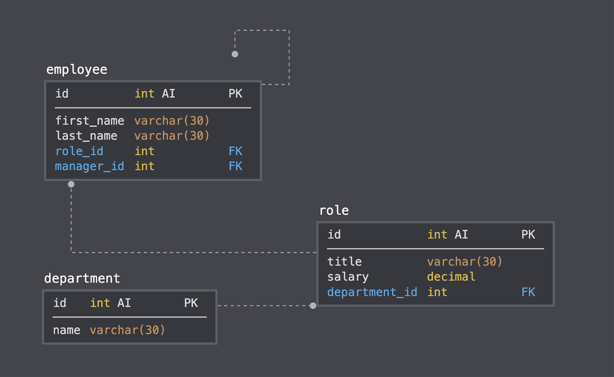

# Employee Tracker


## 💬 Description 
A command-line application to manage a company's employee database, using Node.js, Inquirer, and MySQL.


## 📓 Table of Contents

* [User Story](#user-story)
* [Acceptance Criteria](#acceptance-criteria)
* [Mock-Up](#mock-up)
* [Installation](#installation)
* [Usage](#usage)
* [Built With](#built-with)
* [License](#license)
* [Badges](#badges)
* [Questions](#questions)
* [Contributing](#contributing)


## 🧠User Story
```
AS A business owner
I WANT to be able to view and manage the departments, roles, and employees in my company
SO THAT I can organize and plan my business
```


## 🧩Acceptance Criteria
```
GIVEN a command-line application that accepts user input
WHEN I start the application
THEN I am presented with the following options: view all departments, view all roles, view all employees, add a department, add a role, add an employee, and update an employee role
WHEN I choose to view all departments
THEN I am presented with a formatted table showing department names and department ids
WHEN I choose to view all roles
THEN I am presented with the job title, role id, the department that role belongs to, and the salary for that role
WHEN I choose to view all employees
THEN I am presented with a formatted table showing employee data, including employee ids, first names, last names, job titles, departments, salaries, and managers that the employees report to
WHEN I choose to add a department
THEN I am prompted to enter the name of the department and that department is added to the database
WHEN I choose to add a role
THEN I am prompted to enter the name, salary, and department for the role and that role is added to the database
WHEN I choose to add an employee
THEN I am prompted to enter the employee’s first name, last name, role, and manager and that employee is added to the database
WHEN I choose to update an employee role
THEN I am prompted to select an employee to update and their new role and this information is updated in the database 

```


## 🎨Mock-Up

<br></br>


## 🔌Installation

The user should clone the repository from GitHub and open up the project in their code editor.
<br>User will need to run node.js and perform an _npm install_ for all necessary modules listed below.</br>


## 💻Usage 
To run on localhost:3001, please run command _npm start_ to start the server and _control C_ to stop.
<br>[Click me for walkthrough❗️](https://drive.google.com/file/d/1S0p6LmWYU0owYgD8Jo1iNLrikmha1mwj/view)</br>
<br></br>
 

## ✏️Built With
<p><a href="https://nodejs.org/">Node.js</a></p>
<p><a href="https://www.npmjs.com/">NPM</a></p>
<p><a href="https://www.npmjs.com/package/inquirer">Inquirer.js</a></p>
<p><a href="https://www.mysql.com/">MySQL</a></p>


## 🔐License
```
Copyright © MIT. All rights reserved. 
Licensed under the MIT license.
```


## 🏆Badges


<br></br>
 - Inquirer
<br></br>

<br></br>


## ❓Questions

If you have any questions about this projects, please contact me directly at tpgent01@outlook.com. 
<br>You can view more of my projects at https://github.com/tpgent01 👾</br>


## 📌Contributing

Taylor Gentry ©2021 All Rights Reserved.
